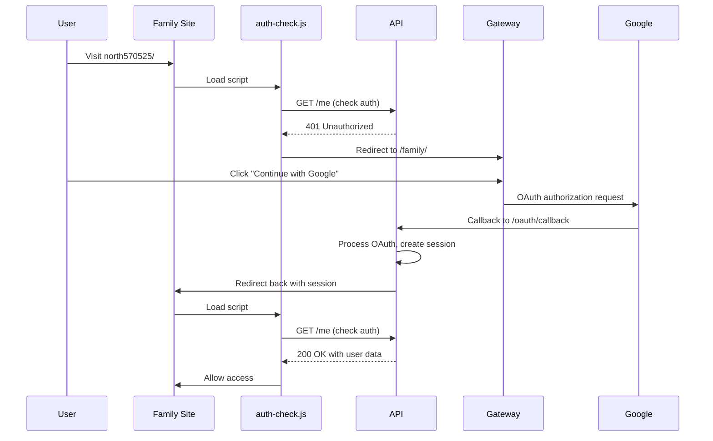

# Google OAuth URLs Configuration

Based on your backend implementation analysis, here are the exact URLs to configure in Google Cloud Console:

## 🌐 Authorized JavaScript Origins

Add these domains to allow JavaScript OAuth calls:

```
https://family.futurelink.zip
https://api.futurelink.zip
https://auth.futurelink.zip
http://localhost:3000
http://localhost:8000
```

## 🔄 Authorized Redirect URIs  

Add these callback URLs based on your backend endpoints:

### Production URLs:
```
https://api.futurelink.zip/oauth/callback
https://auth.futurelink.zip/oauth2callback
https://family.futurelink.zip/auth/callback
```

### Local Development URLs:
```
http://localhost:8000/oauth/callback
http://localhost:3000/auth/callback
http://localhost:8000/auth/google/callback
```

## 🔍 Analysis of Your Backend

Your backend (`1-backend/auth/google.py`) shows:
- **Current redirect URI**: `https://auth.futurelink.zip/oauth2callback` (line 25)
- **OAuth callback endpoint**: `/oauth/callback` (line 285 in main.py)

Your backend is configured to use `auth.futurelink.zip` domain, but your frontend uses `family.futurelink.zip`.

## ⚠️ Configuration Mismatch Found

Your backend expects OAuth callback at:
```
https://auth.futurelink.zip/oauth2callback
```

But your frontend authentication system is deployed to:
```
https://family.futurelink.zip/
```

## 🔧 Recommended Configuration

### Option 1: Use auth.futurelink.zip (Backend Default)
```bash
# Authorized Origins
https://auth.futurelink.zip
https://family.futurelink.zip
https://api.futurelink.zip

# Authorized Redirects  
https://auth.futurelink.zip/oauth2callback
https://api.futurelink.zip/oauth/callback
```

### Option 2: Update Backend to Use api.futurelink.zip (Recommended)
Update your `.env` file:
```bash
OAUTH_REDIRECT=https://api.futurelink.zip/oauth/callback
```

Then configure OAuth with:
```bash
# Authorized Origins
https://family.futurelink.zip
https://api.futurelink.zip

# Authorized Redirects
https://api.futurelink.zip/oauth/callback
```

## 🎯 Quick Setup Commands

### For Google Cloud Console:

1. **Visit**: https://console.cloud.google.com/apis/credentials?project=futurelink-private-112912460

2. **Add these JavaScript Origins**:
```
https://family.futurelink.zip
https://api.futurelink.zip
http://localhost:8000
```

3. **Add these Redirect URIs**:
```
https://api.futurelink.zip/oauth/callback
http://localhost:8000/oauth/callback
```

## 🔄 Frontend Integration Update Needed

Your frontend gateway page needs the actual Google Client ID. Update the family gateway:

```javascript
// In marketing-root/family/index.html, replace:
const GOOGLE_CLIENT_ID = ''; 

// With your actual client ID:
const GOOGLE_CLIENT_ID = 'your-actual-client-id.apps.googleusercontent.com';
```

## 🧪 Test URLs After Configuration

1. **Family Site**: https://family.futurelink.zip/sites/north570525/
2. **Should redirect to**: https://family.futurelink.zip/family/
3. **OAuth flow**: Click "Continue with Google" 
4. **Backend callback**: https://api.futurelink.zip/oauth/callback
5. **Final redirect**: Back to family site with authentication

## 🚀 Integration Flow



---

**Recommendation**: Use `api.futurelink.zip/oauth/callback` as your primary redirect URI since that's where your backend OAuth endpoint is located.